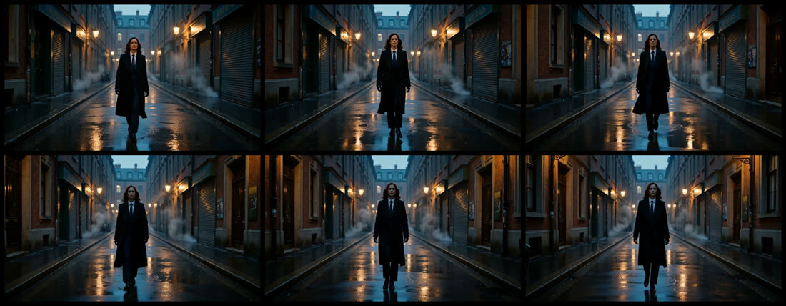
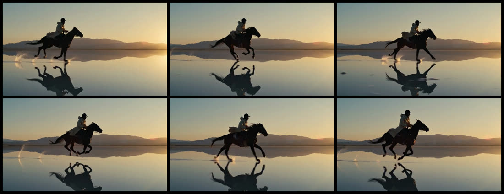
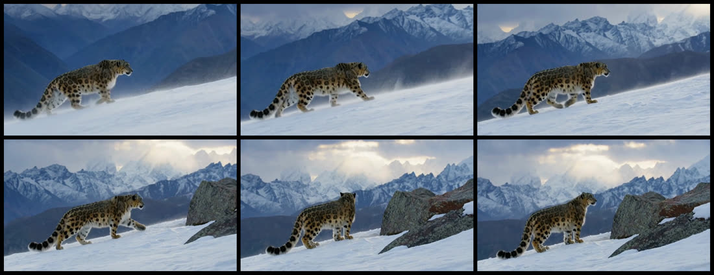
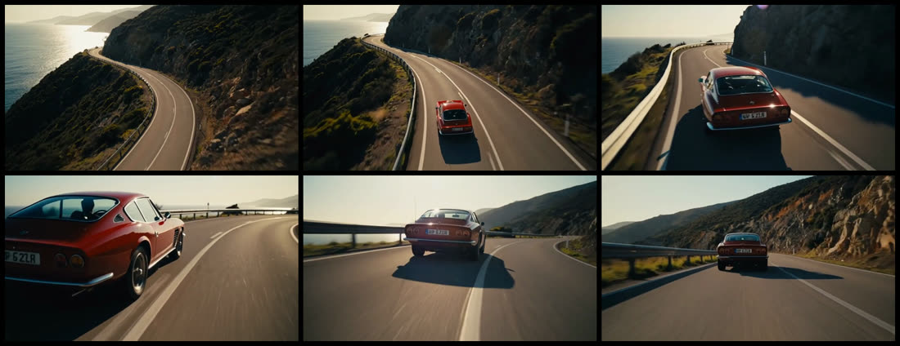

# MiniMax-H3 on Cambricon MLU

<p align="center">
  
</p>

<p align="center"><sub>Original BF16 base model, 50 scheduler points, no acceleration LoRA.</sub></p>

Experimental single-card inference for MiniMax-H3 on Cambricon MLU. The tested route keeps the official BF16
checkpoint in host memory and uses Diffusers `ComponentsManager` to move one component at a time onto an 80 GiB
MLU.

## Demos

| Rainy alley, 5.175s, 1344x768 | Salt-flat rider, 8.000s, 960x544 |
| --- | --- |
|  |  |
| Snow leopard, 10.125s, 960x544 | Coastal car, 14.375s, 960x544 |
|  |  |

These frame sequences were generated with the original BF16 model and MLU Flash Attention. The repository does not
include generated MP4 files or model weights.

## Scope

- `t2va`: text to synchronized video and stereo audio
- `fl2va`: optional first frame, last frame, or both
- BF16 transformer and text encoder weights
- Automatic CPU offload with a configurable memory reserve
- MLU Flash Attention
- 24fps video and 32kHz stereo audio muxed into MP4

The open-source H3-Base checkpoint generates 768p output. The complete 2K workflow also requires the hosted
H3-Context-IR and H3-Regenerate-2K services.

## Repository layout

```text
.
|-- infer.py                 # Command-line inference entry point
|-- interactive.sh          # Interactive generation workflow
|-- run.sh                  # Runtime environment wrapper
|-- setup.sh                # Virtual environment and dependency setup
|-- download*.sh            # Base model and optional Turbo LoRA downloads
|-- minimax_h3_mlu/         # MLU compatibility hooks and step profiling
|-- tools/                  # Model verification and operator smoke tests
`-- docs/                   # Validation, optimization results, and demo assets
```

## Validated configuration

The single-card route has been validated end to end on an 80 GiB MLU590:

- 1344x768, 124 frames, 50 scheduler points
- 1,553.4 seconds end to end
- 69.27 GiB peak allocated MLU memory
- H.264 at 24fps with non-silent AAC stereo audio at 32kHz
- Text-to-video/audio and first-frame-to-video/audio workflows

See [docs/results.md](docs/results.md) for the full test matrix and known warnings.

## Setup

Run commands from this directory:

```bash
source ~/.zshrc
chmod +x setup.sh download.sh download_turbo.sh run.sh interactive.sh
./setup.sh
```

The environment reuses the vendor PyTorch and `torch_mlu` packages through `--system-site-packages`; it does not
install a stock PyTorch wheel. Diffusers is pinned to commit
`1b98ae1060b765f2efe22540f52691b8c00a83f1`.

## Operator smoke test

```bash
source ~/.zshrc
./run.sh --help
NEUWARE_HOME=/usr/local/neuware \
LD_LIBRARY_PATH=/usr/local/neuware/lib64:/usr/local/neuware/lib \
./.venv/bin/python tools/smoke_ops.py
```

This checks a 40k-token Flash Attention call, a reduced H3 transformer, a 124-frame VAE decode, and automatic
CPU offload without downloading model weights.

## Lossless offload optimization

The default `cpu-master` offload mode keeps the original CPU parameter storage while a component runs on MLU. When
the next component needs memory, the MLU copy is discarded and the preserved CPU storage is restored instead of
copying tens of GiB of read-only weights back from MLU. This does not change model arithmetic and produced bitwise
identical raw video and audio tensors in the validation workload. It requires enough host RAM to retain the complete
134 GiB checkpoint throughout inference.

Use the original Diffusers copy-back behavior on a host with tighter RAM limits:

```bash
./run.sh --offload-mode copyback ...
```

For a persistent single-task service, `pinned-master` page-locks the text encoder and transformer CPU masters to speed
up their host-to-MLU transfers. Pinning adds substantial startup time and locked host memory, so it is opt-in and is
not recommended for a one-shot CLI process or a shared node:

```bash
./run.sh --offload-mode pinned-master ...
```

On a multi-socket host, bind CPU allocation to the selected MLU's PCI-local NUMA node with the helper below. It reads
the PCI address from `cnmon`, falls back safely when topology data is unavailable, and forwards all inference options:

```bash
./tools/numa_run.sh --device mlu:0 --prompt "..." ...
```

## Step profiling and exactness checks

The inference entry point can record synchronized per-step timing, capture one steady MLU step, and compare raw
video/audio tensors before MP4 encoding:

```bash
source ~/.zshrc
./run.sh \
  --prompt "A red fox walks through a snowy pine forest, synchronized footsteps and winter wind" \
  --width 960 \
  --height 544 \
  --num-frames 124 \
  --steps 5 \
  --metrics-json outputs/profile/metrics.json \
  --profile-dir outputs/profile/trace \
  --profile-step 1 \
  --raw-output-dir outputs/profile/raw \
  --output outputs/profile/video.mp4
```

Use `--compare-raw-dir outputs/profile/raw` on a later run to report exact equality, maximum absolute difference,
and mean absolute difference. See [docs/optimization-results.md](docs/optimization-results.md) for the measured
operator breakdown and rejected experiments.

## Download

```bash
source ~/.zshrc
./download.sh
```

The download is pinned to model revision `42ed227ee7df40d41602854ae760620d6eb651fe`, resumes partial files, and
stores only the Diffusers FL2VA partition under `models/MiniMax-H3-diffusers`. It excludes the second
`transformer_ref` checkpoint and the duplicate original-format weights. Expected size is about 134 GiB. On
completion, `tools/verify_model.py` checks every indexed shard and safetensors header.

Download the optional Turbo LoRA:

```bash
source ~/.zshrc
./download_turbo.sh
```

Override the mirror or destination when needed:

```bash
HF_ENDPOINT=https://your-hugging-face-mirror.example \
MODEL_DIR=/path/to/MiniMax-H3-diffusers \
./download.sh
```

## Interactive mode

```bash
source ~/.zshrc
./interactive.sh
```

Press Enter to accept defaults. Prompts may span multiple lines; enter `::end` on its own line to start generation.
The default canvas is the model's native 1344x768 resolution. The script supports both `t2va` and `fl2va`,
including optional first and last keyframes.

Before collecting parameters, the script checks `cnmon` for active MLU processes. It displays their PID, owner,
elapsed time, RSS, and command, then asks before sending `SIGTERM`; cancellation is the default. A second confirmation
is required before `SIGKILL` if a process does not exit within 15 seconds. Set
`MINIMAX_H3_SKIP_PROCESS_CHECK=1` only when intentional device sharing is safe.

The performance modes are:

| Mode | Default scheduler points | Model evaluations | Intended use |
| --- | ---: | ---: | --- |
| `quality` | 20 | 19 | Default; original base model without LoRA |
| `turbo` | 9 | 8 | Optional experiment; about 4.27x faster in the tested 768p case |

The 20-point quality default is sufficient for routine generation. Set the scheduler points to `50` when you need
the full 49-evaluation reference trajectory used by the validation benchmark and cinematic gallery.

Turbo mode uses `minimax_h3_turbo_v4_step600_ema.safetensors` at strength `1.0`. It is optimized for 4 to 8 model
evaluations; 8 is used by default to prioritize quality and motion stability. It is an optional community adapter,
not a bit-identical acceleration and may reduce visual quality compared with the base trajectory; see its
[model card](https://huggingface.co/larryvrh/MiniMax-H3-Turbo-Lora) for motion and audio caveats.

## Run

Start with the reduced 960x544, two-grid-point smoke request:

```bash
source ~/.zshrc
./run.sh \
  --prompt "A red fox walks through a snowy pine forest, synchronized footsteps and winter wind" \
  --width 960 \
  --height 544 \
  --num-frames 124 \
  --steps 2 \
  --output outputs/smoke.mp4
```

Run the trained 16:9 canvas with the full 49-evaluation reference trajectory:

```bash
source ~/.zshrc
./run.sh \
  --prompt "A red fox walks through a snowy pine forest, synchronized footsteps and winter wind" \
  --width 1344 \
  --height 768 \
  --num-frames 124 \
  --steps 50 \
  --output outputs/fox-768p.mp4
```

Run the accelerated 8-evaluation profile directly:

```bash
source ~/.zshrc
./run.sh \
  --prompt "A red fox walks through a snowy pine forest, synchronized footsteps and winter wind" \
  --width 1344 \
  --height 768 \
  --num-frames 124 \
  --steps 9 \
  --lora models/loras/minimax_h3_turbo_v4_step600_ema.safetensors \
  --output outputs/fox-768p-turbo.mp4
```

For first-frame conditioning:

```bash
source ~/.zshrc
./run.sh \
  --workflow fl2va \
  --image opening-frame.png \
  --prompt "The camera slowly pushes forward while rain falls, synchronized city ambience" \
  --width 960 \
  --height 544 \
  --num-frames 124 \
  --steps 50 \
  --output outputs/fl2va.mp4
```

MiniMax-H3 is guidance-distilled. It has no `negative_prompt` or `guidance_scale`. Frame counts are aligned to the
VAE's `17n+5` grid and must cover 5 to 15 seconds. The longest valid count below the ceiling is 345 frames, or
14.375 seconds at 24fps. On an 80 GiB card, use 960x544 rather than 1344x768 for this maximum duration. Review the
upstream MiniMax-H3 Community License before redistribution or production use.

## License

The code in this repository is released under the MIT License. Model weights and generated outputs remain subject
to the upstream MiniMax-H3 Community License and any applicable third-party model licenses.
